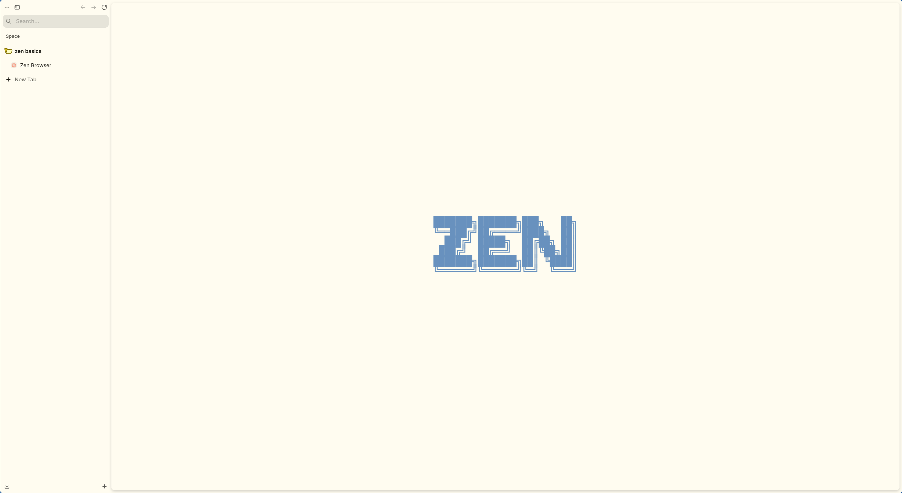
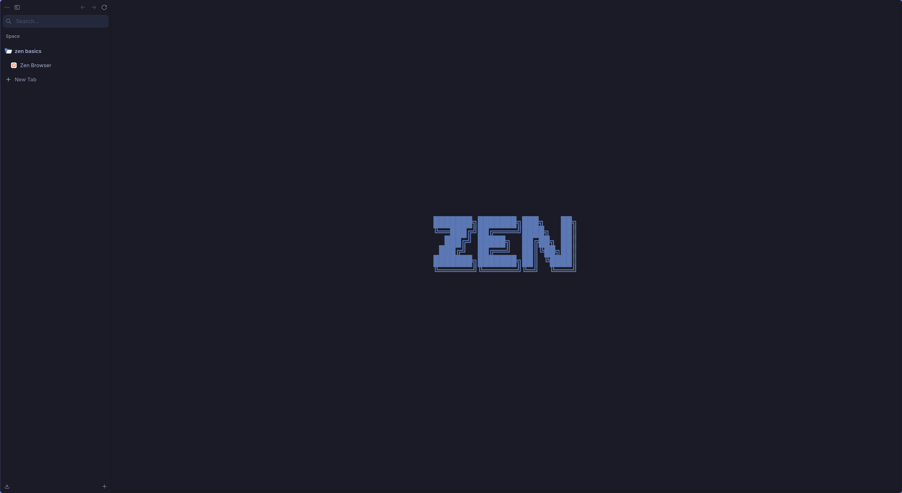

# Omazen

Omazen hot-reloads the active Omarchy Quattro palette into Zen Browser without
restarting Zen after the one-time privileged-loader setup.

> [!IMPORTANT]
> This repository is an unofficial, opinionated fork of
> [hemagome/omazen](https://github.com/hemagome/omazen). It preserves the
> upstream GPL-3.0-only license and required attribution, but its additional
> visual and integration choices are maintained independently and should not be
> attributed to the upstream maintainer. This fork was materially modified in
> August 2026; see the commit history and [NOTICE](NOTICE) for details.

## Preview

The opinionated browser chrome follows the active Omarchy palette across light
and dark themes.

### Light theme



### Dark theme



The runtime normalizes Quattro colors into a fixed JSON file, applies them to
Zen chrome through a privileged bridge, and uses allowlisted WindowActors for
supported internal pages. A shared `inotifywait` subprocess wakes every open
Zen window after atomic palette updates; fixed-file polling remains only as a
failure fallback and a low-frequency safety check. It has no runtime downloads,
local server or page-exposed API. See the [architecture](docs/architecture.md) and
[security model](docs/security.md) for details.

## Current status

Omazen `1.8.1` runs its complete CLI as a directly installed Rust executable,
removing the former Bash implementation and launcher overhead while preserving
the qualified command and rollback contracts. It installs with one command and
includes [Zen web apps](#zen-web-apps) whose pages can take the theme's own
colors on a translucent, blurred window. Canonical stylesheet sources
remain unversioned in the repository and are installed under release-versioned
names for `chrome://` cache busting. The shared event-driven watcher, automatic
polling fallback and external palette-provider compatibility remain intact. The
current tested environment is Omarchy `4.0.2` (Quattro) with native
`zen-browser-bin 1.22b-1`, based on Zen `1.22b` / Firefox `155.0.1`
(64-bit).

The historical live qualification and complete test results are recorded in
the [validation report](docs/validation.md). Compatibility boundaries and
unsupported Zen packaging formats are listed in the
[compatibility guide](docs/compatibility.md).

## Install

On Omarchy 4 (Quattro), one command does everything: it downloads the latest
release, checks it against its SHA-256 checksum, installs whatever is missing
(`zen-browser-bin`, `inotify-tools`, `gum`) and runs the installer, which also
sets up [Zen web apps](#zen-web-apps) with their launcher and Omarchy menu
entries:

```bash
curl -fsSL https://raw.githubusercontent.com/priard/omazen/main/bootstrap.sh | bash
```

Omazen installs a privileged loader into Zen, so read
[the security model](docs/security.md) and, if you like,
[`bootstrap.sh`](bootstrap.sh) before running it. `OMAZEN_RELEASE=vX.Y.Z` picks
a specific release. From a checkout, run the installer directly:

```bash
./install.sh
```

The installer uses a bundled `libexec/omazen-rust` release payload when present
and installs it directly as `bin/omazen`; there is no shell launcher on the
command path. A source checkout without the prebuilt payload requires the
pinned Rust 1.98.0 toolchain once at build time; installed users do not need
Rust or Cargo at runtime. Published Linux x86-64 release archives include the
prebuilt binary and a SHA-256 sidecar.

Close Zen normally and open it once after initial setup. Theme changes after
that are live and do not require a restart.

External desktop integrations that provide an Omazen-compatible `colors.toml`
may opt out of installing the Omarchy hook while retaining Omazen's loader,
palette validation, diagnostics and ownership tracking:

```bash
OMAZEN_ACTIVE_COLORS=/absolute/path/to/colors.toml \
OMAZEN_SKIP_THEME_HOOK=1 \
omazen setup
```

Setup persists the provider mode and active palette source under Omazen's state
directory. Explicit environment variables still take precedence for that
invocation; later `sync` calls use the saved configuration. The external
provider owns triggering `omazen sync` after palette changes. This is an
integration interface, not an expansion of Omazen's official support scope.

The installer writes only Omazen-owned files and never edits
`userChrome.css`, `userContent.css` or `user.js` of your Zen profiles. The one
shared file it touches is the Omarchy menu extension, where it keeps its web app
entries between its own marker comments.

## Commands

```text
omazen setup
omazen sync
omazen set [theme]
omazen status
omazen doctor [--json]
omazen disable
omazen enable
omazen uninstall
omazen webapp install [--theme [--invert] [--opaque]] [name url [icon]]
omazen webapp remove [name]
omazen webapp list
```

- `setup` installs or repairs the integration idempotently.
- `sync` regenerates the normalized palette from the active Quattro theme.
- `set "Theme Name"` delegates to `omarchy theme set` and synchronizes.
- `doctor` checks compatibility, installation integrity, palette freshness and
  bridge health. `doctor --json` emits the same checks as a structured report
  for bug reports and automation.
- `disable` and `enable` update open windows without restarting Zen.
- `uninstall` removes only unchanged files recorded as Omazen-owned.
- `webapp` manages Zen web apps; see [Zen web apps](#zen-web-apps).

The event-driven fast path uses `/usr/bin/inotifywait` from `inotify-tools`.
When it is unavailable or exits unexpectedly, the bridge automatically returns
to the previous 250 ms polling behavior.

## Zen web apps

Alongside Omarchy's Chromium-based web apps, Omazen creates Zen web apps. Each
one opens a single site in its own isolated Zen profile, starts in compact mode
without the sidebar or toolbar, frame, rounded corners or translation pop-up,
and gets its own window class, so the app
launcher, alt-tab and Hyprland rules treat it as a separate application.
Starting a web app that is already open focuses its window; otherwise it opens
the site fresh, like Omarchy's web apps, without restoring the tabs of its
previous session. Sign-ins and site data are kept. Zen shortcuts that would
bring back the sidebar or toolbar or change the layout are switched off, so the
site gets those keys instead: `Ctrl+S` (compact mode), `Ctrl+Alt+S`, `Ctrl+B`,
`Ctrl+H`, `Ctrl+D`, `Ctrl+K`, workspace, split view, Glance and pin shortcuts.
Zen reserves `Ctrl+T`, `Ctrl+N`, `Ctrl+W` and `Ctrl+Q`, so those still work. A
new web app picks this up from its second start, because Zen writes its
shortcut file on the first. Closing the page with `Ctrl+W` closes the web app
rather than leaving an empty window.

The installer (and `omazen setup`) adds **Install Zen Web App** and **Remove Zen
Web App** to the app launcher and the matching entries under Install and Remove
in the Omarchy menu. Without arguments, `install` asks in a terminal for the
name and URL, whether to match the Omarchy theme and, if so, whether the site is
light and whether the window should be translucent (the default). `remove`
offers a picker. The icon may be a URL, an image file or an icon name; by
default the site's own icon is fetched.

```bash
omazen webapp install --theme "Messenger" https://messenger.com
omazen webapp install --theme --invert "Wikipedia" https://wikipedia.org
omazen webapp install --theme --opaque "Mail" https://mail.example.com
```

### Theme-following web apps

With `--theme`, a web app's pages take the colors of the active Omarchy theme
and follow theme switches live:

- **Colors.** A Zen boost is solved from the palette, so a page's white lands on
  the theme's background (the color of Zen's own sidebar and of the terminals)
  and its text on the theme's foreground. Other colors keep their lightness and
  lean toward those hues: it is a tint, not a repaint, so buttons and links
  lose some saturation.
- **Glass.** The window is a translucent layer of the theme background over
  Hyprland's blur of the wallpaper, and the page's own background is cleared
  so its text stays sharp on it. `--opaque`, or answering no at the prompt,
  keeps the window solid.
- **Light and dark.** Pages get the theme's light or dark scheme, so a site
  with its own dark mode switches by itself. `--invert` is for light sites
  without one: under a dark theme the page is inverted, images excepted.

Parts of a page that paint their own background keep it, tinted. Under a dark
theme only inverted pages sit on the glass; a site shown as is keeps its own
background, because its text may be dark. `--theme` installs Omazen's runtime
into that one web app's profile; regular Zen profiles and their boosts are
never touched. The [compatibility guide](docs/compatibility.md)
lists the limits.

Web apps live in `~/.local/share/omazen-webapps/`. `omazen webapp remove`
deletes a web app together with its profile. `omazen uninstall` removes the
launchers and menu entries but keeps the profiles and their sign-ins; a later
setup restores the launchers.

## Compatibility

The official support scope is **Omarchy Quattro plus the native Arch package
`zen-browser-bin`** installed at `/opt/zen-browser-bin`. Zen `1.22b` and
`1.21.16b` are the fully validated versions; native Zen versions `>=1.20` are
compatibility candidates and produce a `doctor` warning until tested. Flatpak, Firefox,
AppImage, tarball, source-build and other non-native installations are outside
the supported scope. Omarchy 3 and earlier are rejected because their generated
theme state uses paths incompatible with Omazen's Quattro palette integration.

Run `omazen doctor` after every Zen update. See the
[compatibility guide](docs/compatibility.md) for the complete contract.

## Development

Read the [contribution guide](.github/CONTRIBUTING.md) before making changes.

Run the disposable functional suite with:

```bash
tests/test.sh
```

Run the WCAG palette contrast checks with:

```bash
node tests/contrast.mjs
```

The checker scans installed Omarchy `colors.toml` files (or the paths in
`OMAZEN_CONTRAST_PALETTE_DIR`) and falls back to edge-case fixtures when the
provider is not installed. Primary button and selection checks are enforced;
link, muted-text and scrollbar findings are reported as warnings while their
surface-specific semantics are being refined. Use `--strict` or
`OMAZEN_CONTRAST_STRICT=1` to promote warnings to failures.

The visual smoke command first runs the deterministic headless fixture and,
when Wayland/Hyprland capture tools are available, also runs
`tests/visual-integration.sh`. The integration pass boots a real Zen runtime
with a disposable profile, captures Settings and browser chrome for dark and
light palettes, exercises live palette changes plus disable/enable, and
compares the captures with a bounded tolerance. Set
`OMAZEN_SKIP_VISUAL_INTEGRATION=1` only for environments without a compositor.

Run the complete pre-release gate, including static analysis, regression tests,
the rendered-pixel smoke test and whitespace checks, with:

```bash
tests/release-gate.sh
```

To measure the current live-update latency with Zen open, see the
[benchmark guide](docs/benchmark.md) and run:

```bash
tests/benchmark.sh --mode all --iterations 20
```

See the [release checklist](docs/release.md) for deployment and publication.

## License

Omazen source code is licensed under GPL-3.0-only, with the required attribution
notice in [NOTICE](NOTICE). Vendored fx-autoconfig files remain under MPL 2.0;
see [third-party notices](THIRD_PARTY_LICENSES.md).
