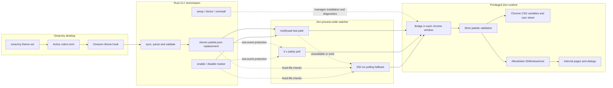

# Architecture



The solid path through `inotifywait` is the normal update route. Dotted edges
represent recovery, safety, or administrative paths rather than additional
palette transformations. All three watcher routes converge on the same bridge
validation before any color reaches Zen chrome or an allowlisted internal page.

```text
omarchy theme set
  -> stage ~/.local/state/omarchy/current/next-theme/colors.toml
  -> generate templates
  -> publish ~/.local/state/omarchy/current/theme/colors.toml
  -> update the running shell
  -> wait for parallel application integrations
  -> run ~/.config/omarchy/hooks/theme-set.d/* sequentially
  -> ~/.config/omarchy/hooks/theme-set.d/theme-set
  -> omazen sync
  -> same-directory temporary JSON + atomic rename
  -> ~/.local/state/omazen/palette.json
  -> shared inotify watcher wakes every privileged Zen chrome bridge
  -> 5 s safety poll while the watcher is healthy
  -> 250 ms fixed-file poll only when the watcher is unavailable
  -> strict schema and color validation
  -> derived accent foreground for primary controls
  -> CSS variables + Omazen-scoped chrome stylesheet
  -> allowlisted Omazen JSWindowActor
  -> allowlisted about: pages and internal dialog documents
```

The installed `bin/omazen` command is the Rust executable itself; there is no
shell process or launcher on the CLI path. Rust owns command parsing, palette
normalization, diagnostics, state changes, setup ownership and uninstall. The
Gecko bridge, WindowActors, CSS and shared `inotifywait` watcher remain
JavaScript/CSS. Release tags and staged installation backups provide rollback
without maintaining a second CLI implementation.

## Theme-change latency

Live theme changes do not require restarting Zen, but they are not necessarily
instantaneous. Omarchy first stages the new theme, generates its templates,
updates the running shell, and waits for its parallel application integrations
to finish. It then executes the scripts in
`~/.config/omarchy/hooks/theme-set.d/` sequentially and in lexicographic order.

Omazen can generate `palette.json` only when its hook is reached. Other hooks
ordered before Omazen may therefore add to the visible delay. Once the palette
has been written, a shared `inotifywait` subprocess observes the same-directory
atomic rename and immediately wakes every open Zen chrome bridge. A 5-second
safety poll covers lost events while the watcher is healthy. If the watcher
cannot start or exits, every bridge automatically returns to the previous
250 ms polling behavior.

Palette normalization uses Omarchy 4's `omarchy-theme-color` resolver when it
is available. This keeps full semantic Quattro themes and legacy repository
themes that provide only `background`, `foreground`, `accent` and ANSI
`color0`…`color15` entries consistent with Omarchy's generated application
configs. The local strict parser remains a compatibility fallback.

Observed latency depends on the installed hooks, active applications, theme
complexity, and whether an integration performs first-run work. It should not
be treated as a fixed Omazen performance guarantee.

## State contract

```json
{
  "schema_version": 1,
  "mode": "dark",
  "accent": "#89b4fa",
  "background": "#1e1e2e",
  "background_dark": "#181825",
  "background_light": "#313244",
  "foreground": "#cdd6f4",
  "foreground_muted": "#6c7086",
  "selection": "#45475a",
  "border": "#585b70"
}
```

The bridge rejects missing keys, unknown keys, wrong schema versions, non-object JSON, modes other than `dark`/`light`, colors other than `#RRGGBB`, and files outside 2–2048 bytes. The JSON cannot supply paths, selectors, CSS or executable text.

## Window behavior

fx-autoconfig injects `omazen-bridge.uc.js` into each top-level browser chrome
document. `OmazenWatcher.sys.mjs` is a process-wide singleton, so all browser
windows share one fixed-command `inotifywait` subprocess while applying the
current palette independently. The bridge observes only the exact
`Browser:About`, `Places:Organizer` and `devtools:toolbox` window types and
applies the same validated palette to existing or later-created About Zen,
Library and Developer Tools windows; other auxiliary windows are ignored. A
later-created browser window reads the existing JSON during initial injection.

`OmazenPalette.sys.mjs` owns the shared color keys, strict palette and payload
validation, WCAG contrast calculation, derived accent foreground selection,
actor payload construction, and root-variable application used by both the
chrome bridge and child actor. The derived foreground is an internal v1 token;
it is not accepted from providers or persisted as a new schema field.

The actor is registered only for a fixed list of internal `about:` documents plus Zen's Spotlight, Firefox's common-dialog and Print documents, and the `chrome://devtools/content/` namespace. This covers Passwords, Translations, Print, Remote Debugging and the in-browser Developer Tools without granting access to ordinary content. It reads validated palette preferences when the actor is created and at `DOMContentLoaded`, and accepts only `Omazen:Apply` messages matching the same strict color contract. It is not registered for `http:`, `https:`, arbitrary extension pages or other chrome namespaces.

The chrome-window `MutationObserver` watches for late internal surfaces but only
schedules a debounced broadcast when an added node is, or contains, a `<browser>`.
The observer and all bridge timers are released when the window unloads.

Passwords, Print and some Developer Tools documents can run in isolated processes that do not instantiate the custom actor. The bridge therefore also registers a Firefox user sheet generated from a fixed template. Its internal-page rules are scoped with `@-moz-document` to the exact Passwords, Translations, Print and DevTools URL families. A separate rule matches `http:`, `https:` and `file:` documents solely to set `scrollbar-color` on their scrollable elements; it does not recolor page content or expose a JavaScript API to web origins. Both sections receive only the already validated palette colors, and the sheet is replaced atomically when the palette changes and unregistered on disable. Print's preview canvas and document remain unmodified, and its system-dialog link continues to hand off to the external GTK/portal surface.

Runtime diagnostics are bounded: before `bridge.log` would exceed 128 KiB, the
bridge replaces `bridge.log.1` with the previous active log and starts a fresh
file. `doctor` reads the archive before the active log so health state remains
continuous across rotation. Bridge CSS probes retry for a short bounded window
before recording an error, and successful palette/CSS events include a stable
per-profile identifier without recording the profile path. `omazen doctor`
compares those events with the current normalized palette and can emit a
machine-readable report with `omazen doctor --json`.

The provider mode and active colors source are persisted as private state files
alongside `palette.json` after setup. This lets an external provider omit its
environment variables on later commands while preserving explicit invocation
overrides.

## Enable and disable

`omazen disable` creates the fixed `~/.local/state/omazen/disabled` marker. Each bridge removes its scope attribute and variables, sets the internal-page preference to disabled and broadcasts a disable message. `omazen enable` removes that marker and atomically rewrites the palette. No restart is involved.

## Application updates

`install.sh` builds a complete application copy in a `mktemp` directory beside
the destination and runs `setup` from that staged tree. A failed setup removes
the staging directory and leaves the active application copy unchanged. After a
successful setup, the old directory is renamed to a timestamped backup and the
staged directory is renamed into place on the same filesystem. This replacement
prevents files removed by newer releases from surviving an update. Stylesheets
have stable canonical source names in the repository, while installation copies
them to release-versioned profile paths. This keeps contributions applicable
across releases without giving up the `chrome://` cache busting required at
runtime.

## Zen web apps

`omazen webapp` creates web apps alongside Omarchy's Chromium-based ones. Each
web app lives in `~/.local/share/omazen-webapps/<id>/` (`$XDG_DATA_HOME` when
set): plain-text `name`, `url` and `icon` files, optional `hosts` and `invert`
markers, and a dedicated Zen `profile`. That profile's `user.js` starts Zen in
compact mode with the tab bar and toolbar hidden and no hover reveal, and skips
first-run, update and default-browser prompts. It also removes the gap Zen
leaves around the page, which otherwise reads as a rounded, shadowed card and,
in compact mode, as a panel edge on the left, so the window border is the web
app's only frame. It also keeps Zen's translations offer from opening its
panel, which in compact mode would slide the toolbar out. Zen keeps a minimum
radius on the page that no preference removes, so the profile also gets a
`chrome/userChrome.css` marked `omazen:webapp-managed` that squares the page
and drops Omazen's rounding and shadow. Setup regenerates these managed
preferences in every web app profile and keeps any preference the user added;
it rewrites the userChrome.css only while it still carries the marker. The launcher
`~/.local/share/applications/omazen-webapp-<id>.desktop` carries an
`X-Omazen-Webapp` ownership marker and runs `omazen webapp launch <id>`, which
focuses the web app's window when Hyprland already shows one and otherwise
starts `zen-bin --profile <profile> --name omazen-webapp-<id> <url>` through
`uwsm-app`. The `--name` value becomes the Wayland class, so each web app is a
separate application for the launcher, alt-tab and window rules. Zen's kiosk
mode is not used: it keeps Zen's sidebar, requests real fullscreen and disables
context menus.

`--theme` installs the regular profile runtime into that one profile and records
the hosts the web app serves in `omazen.webapp.hosts`. Themed web app profiles
count as Omazen profiles, so setup upgrades their runtime, doctor checks it and
uninstall removes it. In such a profile the bridge starts
`OmazenBoosts.sys.mjs`, which turns each applied palette into a Zen boost per
recorded host through Zen's own boosts manager, so open tabs update without a
reload. Zen's boost is a duotone filter in Oklab: dark colors lean toward an
accent and light ones toward a hue-rotated complement, with a single strength
that blends chroma, pulls lightness and turns hue. The driver solves the
accent, the rotation and the strength from the palette so that a page's white
lands on the theme background and its text on the foreground. For an inverted
page it aims at the colors that Zen's lightness inversion and channel floor
turn into them. Zen notifies boost updates synchronously from inside its own save, so
the driver reacts only through a short timer and settles into a no-op once the
boost matches the palette; a save attempted before Zen has loaded its boost
store is retried when that load finishes. The bridge refuses to start the
driver unless the profile directory lies inside the web apps directory, so a
copied preference cannot theme a regular profile.

A themed web app is glass unless it was created with `--opaque` (an `opaque`
marker, recorded as `omazen.webapp.glass` false; setup writes the transparency
preferences as false then, because Zen keeps a preference once set). A glass
profile sets `zen.widget.linux.transparency`,
which gives the Zen window an alpha channel that Hyprland blurs, and
`browser.tabs.allow_transparent_browser`, which lets the page itself be
transparent. When the bridge runs the boost driver it marks the window root
with `data-omazen-webapp` and, for glass, `data-omazen-webapp-glass`; the chrome
stylesheet then paints one
translucent layer of the palette background on `#zen-browser-background` and
clears every surface above it. Under a light theme, or when the page is
inverted, the boost carries a fixed custom stylesheet that makes the page's
`html` and `body` transparent; a page shown as is under a dark theme keeps its
background, because a light site's dark text would be unreadable on dark glass.

A page takes its `prefers-color-scheme` from its browser element, which Zen
otherwise leaves on the desktop's scheme. In a web app window the stylesheet
sets that element's `color-scheme` from the palette mode, so a site with its
own dark mode follows the theme. For a web app marked `--invert` the bridge
adds `data-omazen-webapp-invert` and the page keeps the light scheme; a dark
scheme would be inverted back to light.

`omazen setup` also installs `org.omazen.WebAppInstall.desktop` and
`org.omazen.WebAppRemove.desktop` and adds Install and Remove entries to
`~/.config/omarchy/extensions/omarchy-menu.jsonc`, between
`// >>> omazen web apps` and `// <<< omazen web apps` markers placed right after
the object's opening brace. Omarchy strips whole-line comments and trailing
commas before parsing, so the block never has to touch the user's entries.
Setup also rewrites the launcher of every existing web app, which restores them
after a reinstall.

## Installation ownership

Omazen records only files it created in `~/.local/state/omazen/owned/`, including an expected SHA-256. Upgrades back up owned files before replacement. Uninstall deletes a recorded file only when its current hash still matches the recorded hash; modified files are retained with a warning. Identical pre-existing files are reused but not claimed.

The web app launchers installed by setup are recorded in the separate
`integration-files` manifest. The Omarchy menu block is owned by its marker
comments rather than by a hash, because the file around it belongs to the user;
uninstall removes the block and leaves the rest of the file as it was. Web app
launchers are recognised by their ownership marker. Uninstall removes them, but
keeps the web app profiles, which hold the user's sign-ins and site data; a
later setup restores their launchers.
